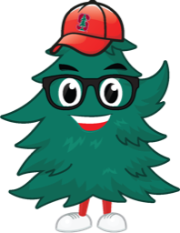

# Stanford Tree Game

Build a playable game starring Cardy, the Stanford Tree, in 30 minutes with [Factory](https://factory.ai) Droid.

This repo is the blank screen: a canvas, a game loop, input handling, and Cardy. What you build on it is up to you.

<p align="center"></p>

## Quickstart

**1. Install Droid**

```bash
# macOS / Linux
curl -fsSL https://app.factory.ai/cli | sh

# Windows (PowerShell)
irm https://app.factory.ai/cli/windows | iex
```

**2. Clone and run the game**

```bash
git clone https://github.com/factory-ashley-jepson/stanford-tree-game.git
cd stanford-tree-game
python3 -m http.server 8000     # Windows: py -m http.server 8000
```

Open http://localhost:8000. You should see Cardy. Press any key and Cardy hops.

**3. Start Droid** in a second terminal, in the same folder:

```bash
droid
```

Sign in with your Factory account when the browser opens.

## Build it like a real team

You'll take your game through a small version of the software development lifecycle.

| Step | What you do | What Droid uses |
| ---- | ----------- | --------------- |
| **1. Plan** | Type `/plan-game` and answer a few questions. Droid writes your game plan to `SPEC.md`. | A skill (`.factory/skills/plan-game`) |
| **2. Build** | Ask: `build SPEC.md`. Droid builds it one checklist item at a time. | `AGENTS.md`, the always-on project rules |
| **3. Test** | Type `/playtest`. Droid checks every Definition of done item and shows pass or fail. Run `/review` for a code review. | A skill (`.factory/skills/playtest`) |
| **4. Ship** | Ask Droid to commit your work. Then deploy it if you have time (below). | Git |

Then go around the loop again: add a stretch goal to `SPEC.md`, build it, test it, ship it.

**Tips**

- Press **Shift+Tab** to switch modes. Spec mode makes Droid plan before it edits.
- Keep the game running in your browser and refresh after each change.
- Small asks work best: "make the acorns fall faster over time" beats "make it better".

## Need an idea?

You don't need one: `/plan-game` will help. Some starting points:

- **Dodge:** Cardy dodges falling acorns, footballs, or Cal Bears.
- **Runner:** Cardy runs across Main Quad, jumping bikes and scooters.
- **Flyer:** Cardy flaps between Hoover Towers.
- **Catch:** Cardy catches boba before finals week ends.
- **Rhythm:** hit the keys on the beat with the Stanford Band.

## Stretch goals

- Sound effects (the Web Audio API needs no files)
- A high score saved in `localStorage`
- Difficulty that ramps up over time
- Touch controls for phones
- A title screen and a game-over screen with your best score

## Deploy and share

Ask Droid: `deploy this game to GitHub Pages from my own GitHub repo`. You'll need the [GitHub CLI](https://cli.github.com) signed in, or Droid will walk you through doing it on github.com. The game is plain files, so any static host works, including Vercel (`npx vercel`).

## Bonus: put Droid on a schedule

Factory **Automations** run Droid for you on a schedule, from Slack, on GitHub events, or from webhooks.

[`automations/dining-digest`](automations/dining-digest) is a working example: every morning it checks all 9 Stanford dining hall menus and DMs you where to eat, based on your preferences. Copy its `PROMPT.md` into [app.factory.ai/automations](https://app.factory.ai/automations) (**New automation**, then **Create with Droid**) and make it yours.

## Credits

Cardy, the Stanford Tree artwork in `assets/`, is from [Stanford Financial Aid](https://financialaid.stanford.edu/images/Cardy.png) and belongs to Stanford University. It is included for this classroom workshop only. The code is MIT licensed (see `LICENSE`).
