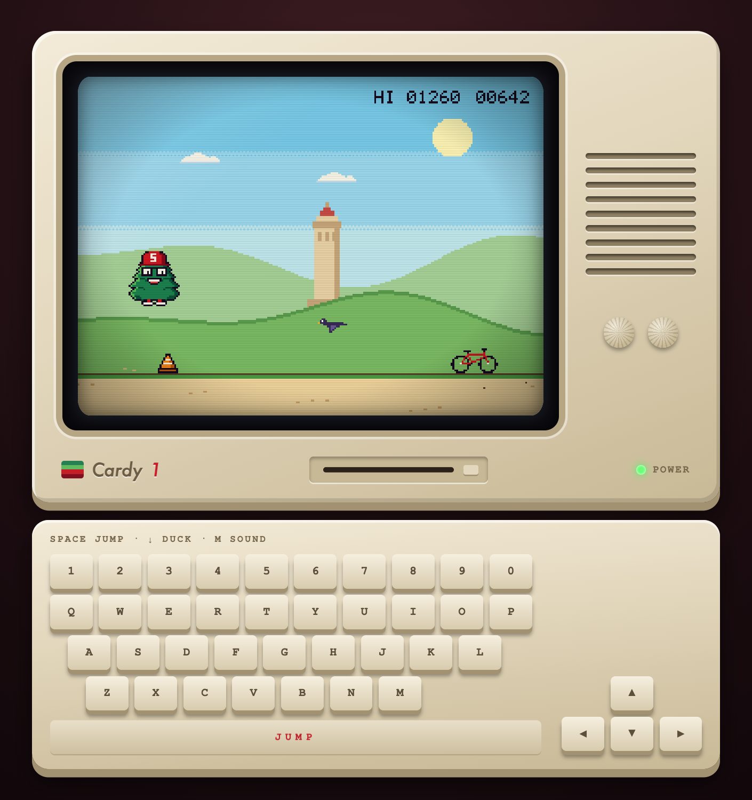

# Stanford Tree Game

Remix a retro arcade game starring Cardy, the Stanford Tree, in 30 minutes with [Factory](https://factory.ai) Droid.

> **You're on the `example` branch.** This is a finished remix, **Big Game Run**, built with one pass through plan, build, test, ship: a double jump, Cal Bears, acorns for bonus points, a boba shield, and day turning to night. See `SPEC.md` for its plan and checked-off Definition of done. To start your own remix, use the `main` branch.

This repo starts as **Tree Run**, a pixel-art runner inspired by the Chrome dinosaur game, playing on an old-school computer. Cardy runs across campus, jumps cones and bikes, and ducks under birds. What it becomes is up to you.

<p align="center"></p>

## Quickstart

**1. Install Droid**

```bash
# macOS / Linux
curl -fsSL https://app.factory.ai/cli | sh

# Windows (PowerShell)
irm https://app.factory.ai/cli/windows | iex
```

**2. Clone and run the game**

```bash
git clone https://github.com/factory-ashley-jepson/stanford-tree-game.git
cd stanford-tree-game
python3 -m http.server 8000     # Windows: py -m http.server 8000
```

Open http://localhost:8000 and press **Space** (or tap the screen) to run. **Space** or **Up** jumps, **Down** ducks, and **M** mutes the sound. On a phone, use the keys under the screen.

**3. Start Droid** in a second terminal, in the same folder:

```bash
droid
```

Sign in with your Factory account when the browser opens.

## Build it like a real team

You'll take your remix through a small version of the software development lifecycle.

| Step | What you do | What Droid uses |
| ---- | ----------- | --------------- |
| **1. Plan** | Type `/plan-game` and answer a few questions. Droid writes your remix plan to `SPEC.md`. | A skill (`.factory/skills/plan-game`) |
| **2. Build** | Ask: `build SPEC.md`. Droid builds it one checklist item at a time. | `AGENTS.md`, the always-on project rules |
| **3. Test** | Type `/playtest`. Droid checks every Definition of done item and shows pass or fail. Run `/review` for a code review. | A skill (`.factory/skills/playtest`) |
| **4. Ship** | Ask Droid to commit your work. Then deploy it if you have time (below). | Git |

Then go around the loop again: add a stretch goal to `SPEC.md`, build it, test it, ship it.

**Tips**

- Press **Shift+Tab** to switch modes. Spec mode makes Droid plan before it edits.
- Keep the game running in your browser and refresh after each change. If you don't see a change, hard refresh (**Cmd+Shift+R**, or **Ctrl+Shift+R** on Windows).
- Small asks work best: "add a boba power-up that makes Cardy invincible for 3 seconds" beats "make it better".

## What's in the box

| File | What it is |
| ---- | ---------- |
| `game.js` | The whole game: tuning numbers at the top, then update and draw. Start here. |
| `sprites.js` | The pixel art. Each sprite is rows of letters, and each letter is a color from the palette. |
| `engine.js` | Helpers: `drawSprite`, `drawText`, `rect`, `input`, `beep`, `save`/`load`, and the game loop. |
| `index.html`, `style.css` | The retro computer around the screen, including the keyboard that lights up as you type. |
| `assets/` | High-resolution Cardy images, for a title screen or anything else. |

The screen is 256x192 pixels, scaled up so every pixel stays crisp.

## Remix ideas

You don't need one: `/plan-game` will help. Some starting points:

- **New setting:** Big Game night, finals week at Green Library, a run down Palm Drive at sunset.
- **New obstacles:** Cal Bears, scooters, tour groups, falling acorns.
- **New moves:** a double jump, a dash, or a glide.
- **Collectibles:** grab boba or acorns for bonus points.
- **Power-ups:** a shield, slow motion, or a magnet.
- **A different game:** keep the engine and the computer, and turn it into a flyer, a dodger, or a catch game.

## Stretch goals

- Day and night: the sky darkens every 500 points, with stars and a moon
- A power-up with a timer bar on screen
- Background music made with `beep()`
- A pause key
- Lives or hearts instead of one-hit game over
- Your own pixel art in `sprites.js`

## Deploy and share

Ask Droid: `deploy this game to GitHub Pages from my own GitHub repo`. You'll need the [GitHub CLI](https://cli.github.com) signed in, or Droid will walk you through doing it on github.com. The game is plain files, so any static host works, including Vercel (`npx vercel`).

## Bonus: put Droid on a schedule

Factory **Automations** run Droid for you on a schedule, from Slack, on GitHub events, or from webhooks.

[`automations/dining-digest`](automations/dining-digest) is a working example: every morning it checks all 9 Stanford dining hall menus and DMs you where to eat, based on your preferences. Copy its `PROMPT.md` into [app.factory.ai/automations](https://app.factory.ai/automations) (**New automation**, then **Create with Droid**) and make it yours.

## Credits

Cardy, the Stanford Tree, belongs to Stanford University. The images in `assets/` are from [Stanford Financial Aid](https://financialaid.stanford.edu/images/Cardy.png), and the pixel-art Cardy in `sprites.js` is based on them. Both are included for this classroom workshop only. The code is MIT licensed (see `LICENSE`).
